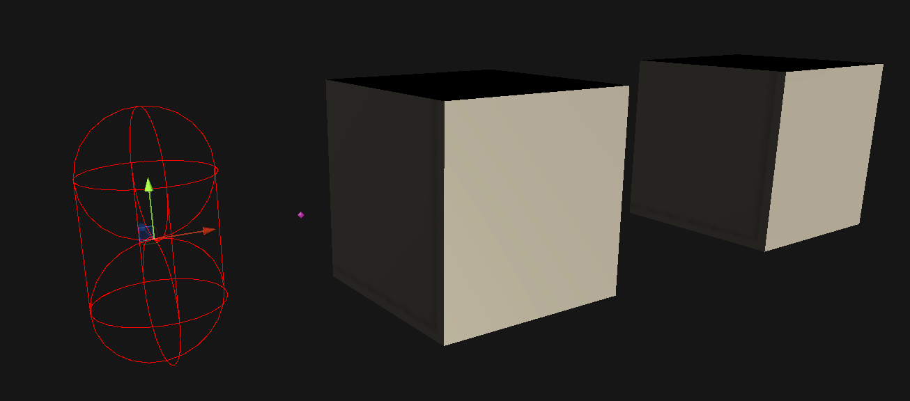
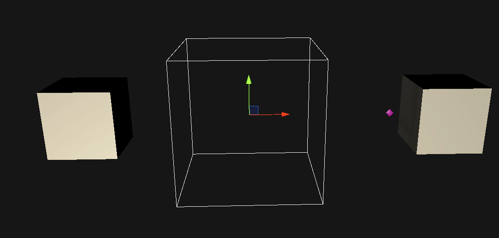
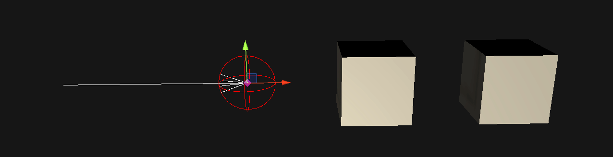
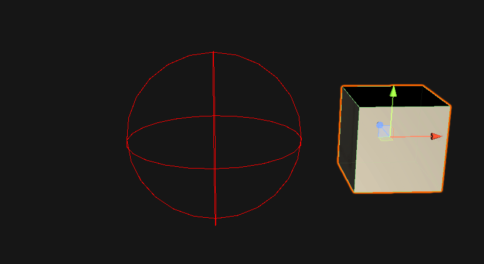

# Raycast Visualization
This asset allows users to view raycasts as the user fires them.

Currently only supports the 3d physics API (The 2D api will be coming soon).

## Usage
Replace `Physics.` with `VisualPhysics.` when firing a raycast to get a visual.

## Installation
#### Using Unity Package Manager
1. Open the Package Manager from `Window/Package Manager`
2. Click the '+' button in the top-left of the window
3. Click 'Add package from git URL'
4. Provide the URL of this git repository: https://github.com/nomnomab/RaycastVisualization.git
5. Click the 'add' button
#### User Options
The user options are located under `Edit/Preferences/RaycastVisualization`

## Examples
#### Raycast / Linecast

#### RaycastAll / RaycastNonAlloc

#### CapsuleCast

#### CapsuleCastAll / CapsuleCastNonAlloc

#### CheckCapsule

#### OverlapCapsule / OverlapCapsuleNonAlloc

#### BoxCast

#### BoxCastAll / BoxCastNonAlloc

#### CheckBox

#### OverlapBox / OverlapBoxNonAlloc

#### SphereCast

#### SphereCastAll / SphereCastNonAlloc

#### CheckSphere

#### OverlapSphere / OverlapSphereNonAlloc

#### Compute Penetration

#### Closest Point

