This asset allows users to view raycasts as the user fires them.

Supports both the 2D and 3D api.

## Usage
To get a visual to show up for a physics call simply do the following:

#### For 3D:
- Replace `Physics.` with `VisualPhysics.`.

#### For 2D:
- Replace `Physics2D.` with `VisualPhysics2D.`.
- Some 2D functions rely more on a 3D perspective in the editor depending on the orientation of the casts.

```csharp
// Example
void SomeFunction() {
    if (VisualPhysics.Raycast(position, direction)) {
        Debug.Log("Hit!");
    }
}
```

## Installation
#### Using Unity Package Manager
1. Open the Package Manager from `Window/Package Manager`
2. Click the '+' button in the top-left of the window
3. Click 'Add package from git URL'
4. Provide the URL of this git repository: https://github.com/nomnomab/RaycastVisualization.git
5. Click the 'add' button
#### User Options
The user options are located under `Edit/Preferences/RaycastVisualization`

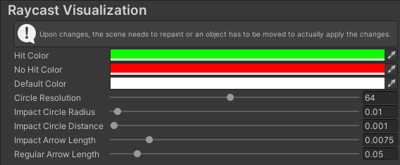

## Examples
<details>
    <summary>3D API (click to expand)</summary>

#### Raycast / Linecast


#### RaycastAll / RaycastNonAlloc


#### CapsuleCast


#### CapsuleCastAll / CapsuleCastNonAlloc


#### CheckCapsule


#### OverlapCapsule / OverlapCapsuleNonAlloc
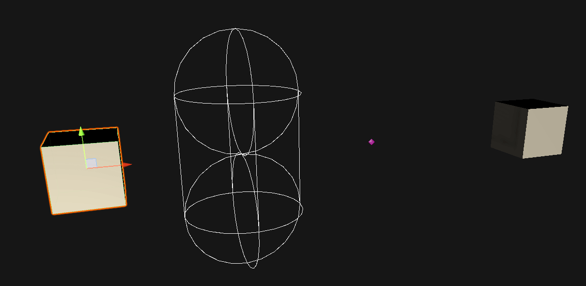

#### BoxCast


#### BoxCastAll / BoxCastNonAlloc


#### CheckBox


#### OverlapBox / OverlapBoxNonAlloc


#### SphereCast


#### SphereCastAll / SphereCastNonAlloc


#### CheckSphere


#### OverlapSphere / OverlapSphereNonAlloc


#### Compute Penetration


#### Closest Point

</details>

<details>
    <summary>2D API (click to expand)</summary>

#### Raycast
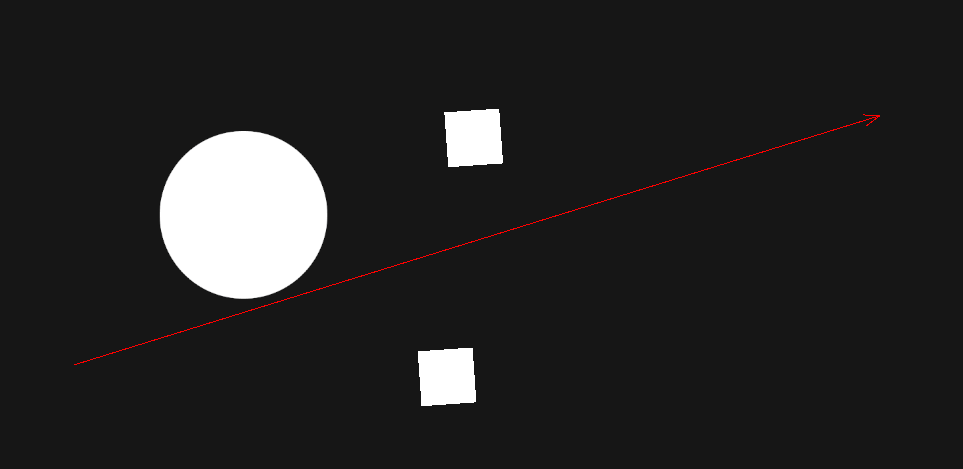

#### RaycastAll / RaycastAll / RaycastNonAlloc
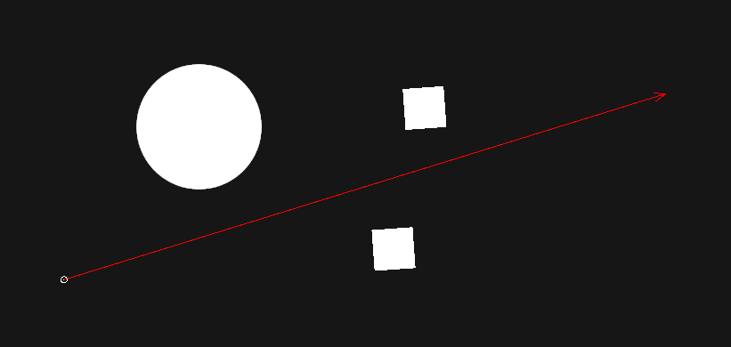

#### CapsuleCast
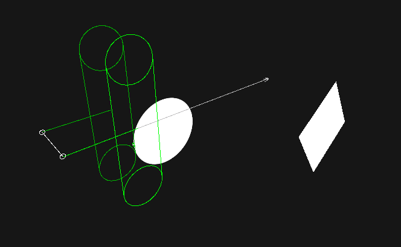

#### CapsuleCastAll / CapsuleCastAll / CapsuleCastNonAlloc
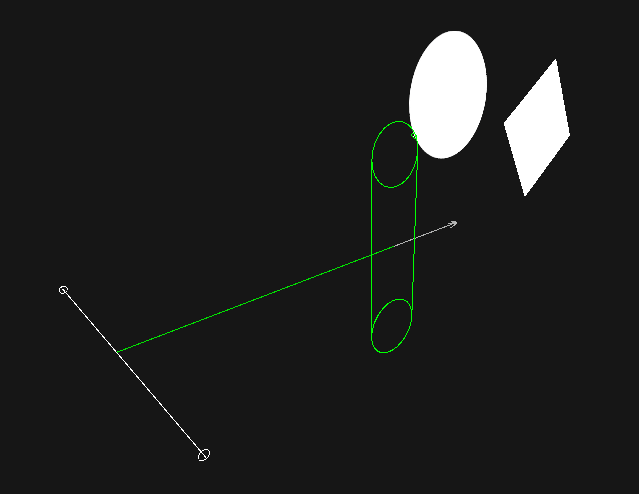

#### OverlapCapsule
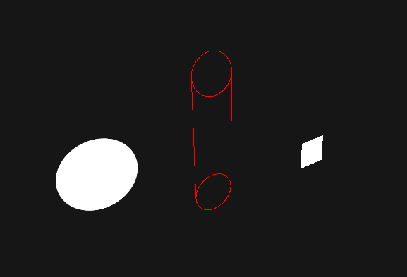

#### OverlapCapsuleAll / OverlapCapsuleNonAlloc
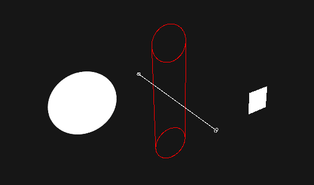

#### BoxCast
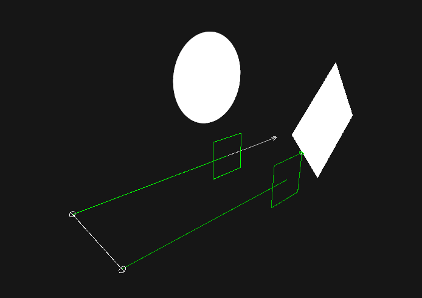

#### BoxCastAll / BoxCastAll / BoxCastNonAlloc
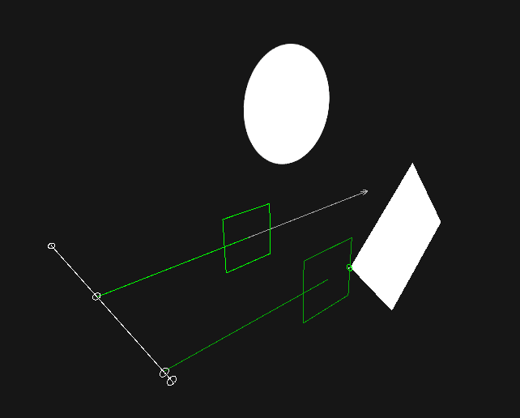

#### OverlapBox
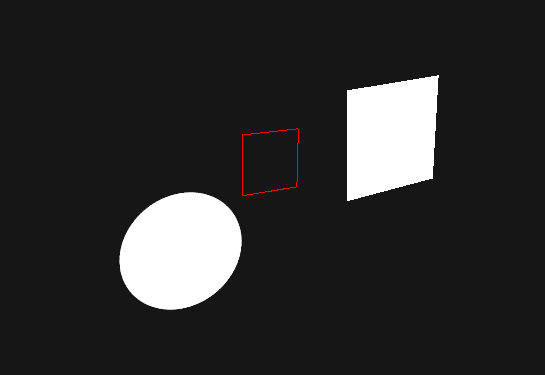

#### OverlapBoxAll / OverlapBoxNonAlloc
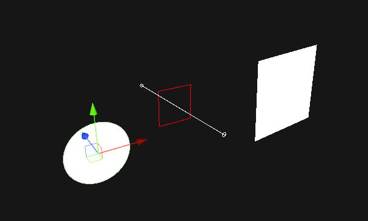

#### CircleCast
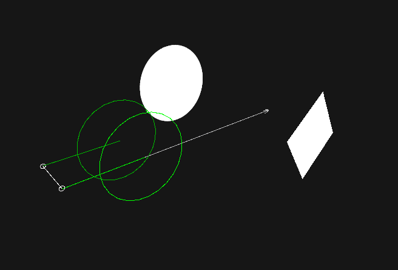

#### CircleCastAll / CircleCastAll / CircleCastNonAlloc
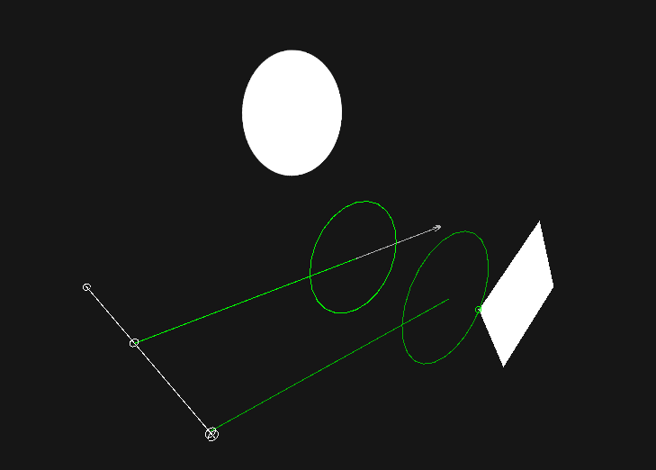

#### OverlapCircle
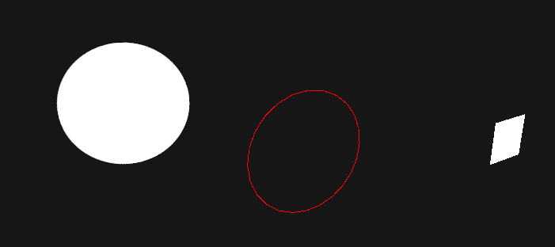

#### OverlapCircleAll / OverlapCircleNonAlloc
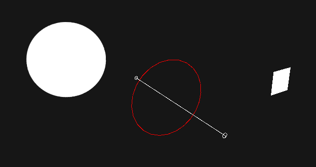

#### OverlapPoint
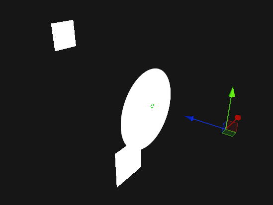

#### OverlapPointAll / OverlapPointNonAlloc
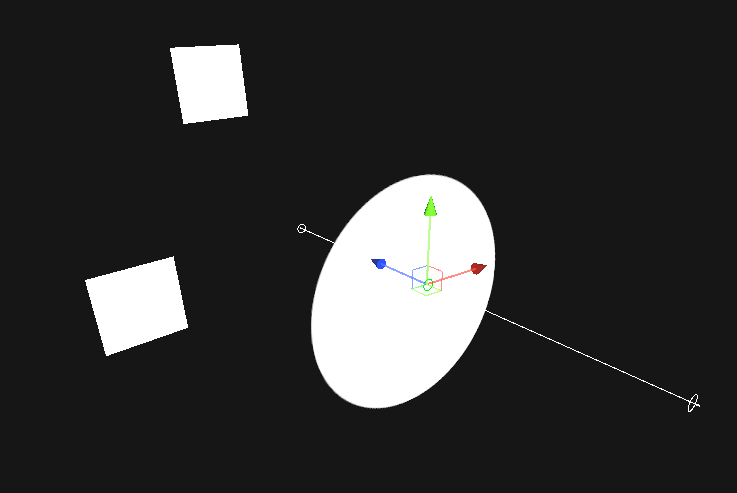

#### OverlapArea
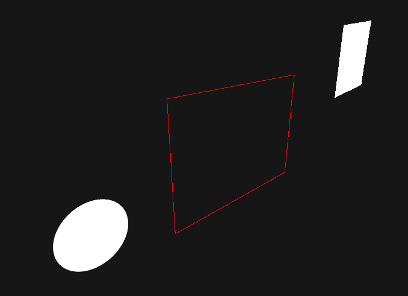

#### OverlapAreaAll / OverlapAreaNonAlloc
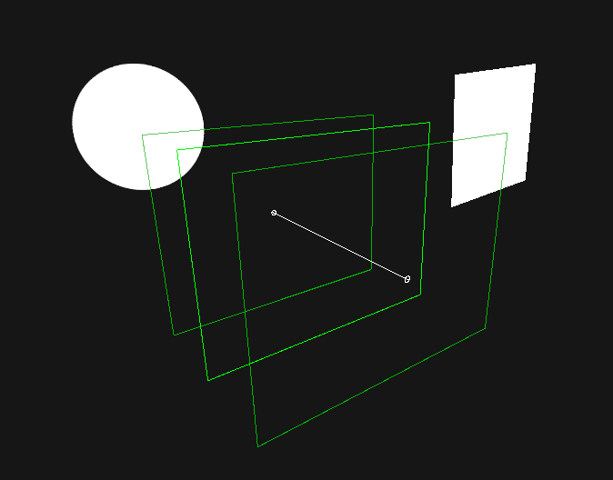

#### OverlapCollider
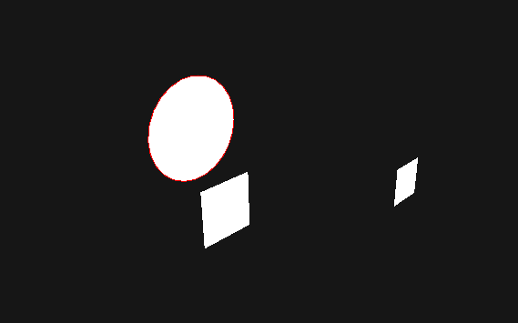

#### Closest Point
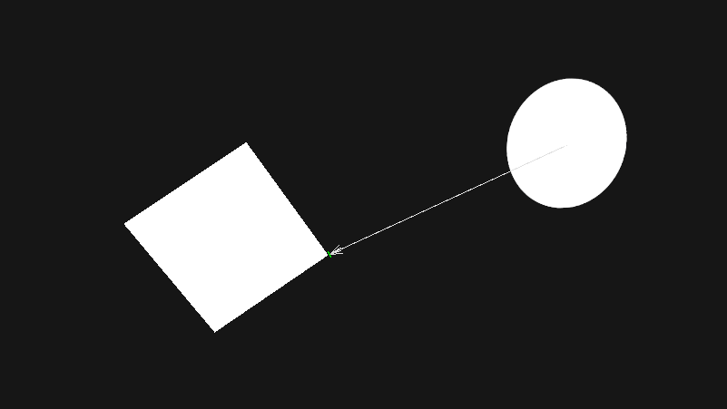

#### Distance


#### GetContacts
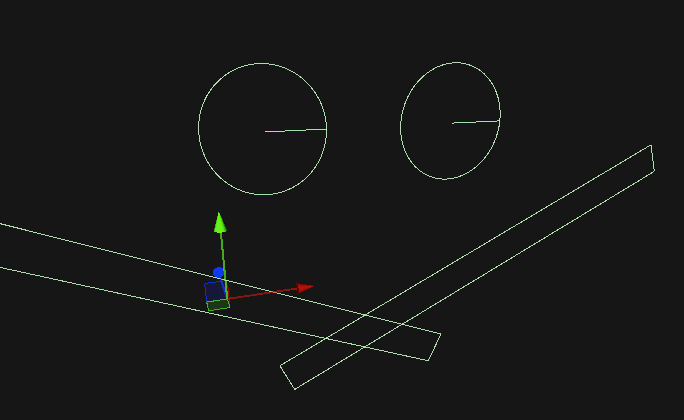

#### GetContacts (points)
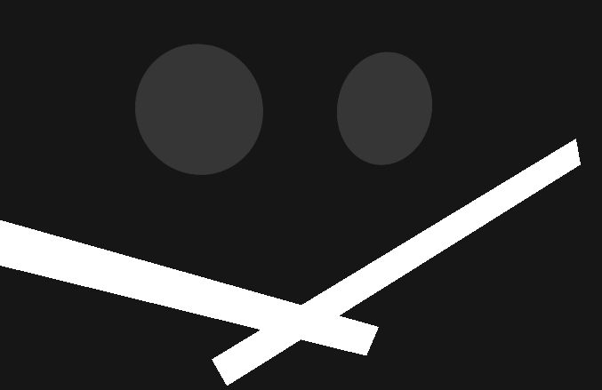

#### IsTouching
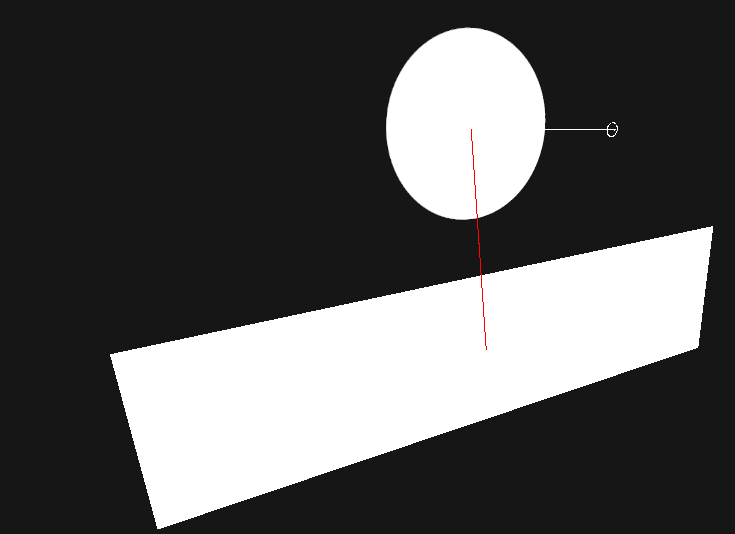

#### IsTouchingLayers
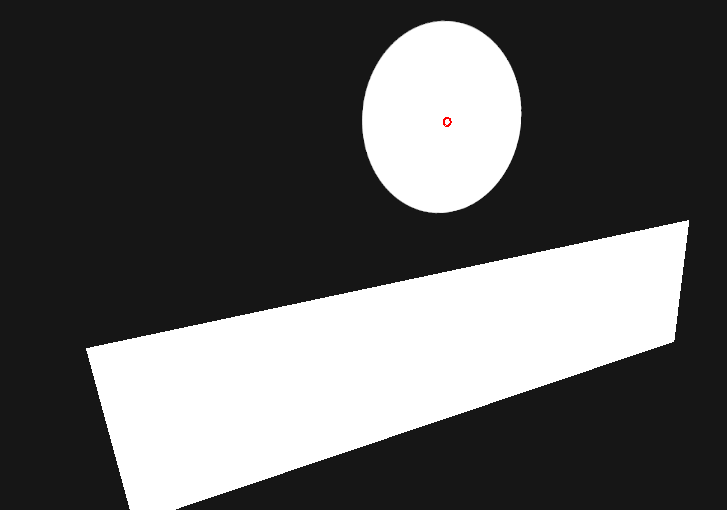

#### GetRayIntersection
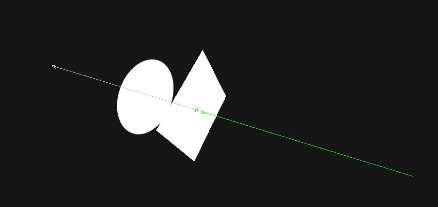

#### GetRayIntersectionAll / GetRayIntersectionNonAlloc
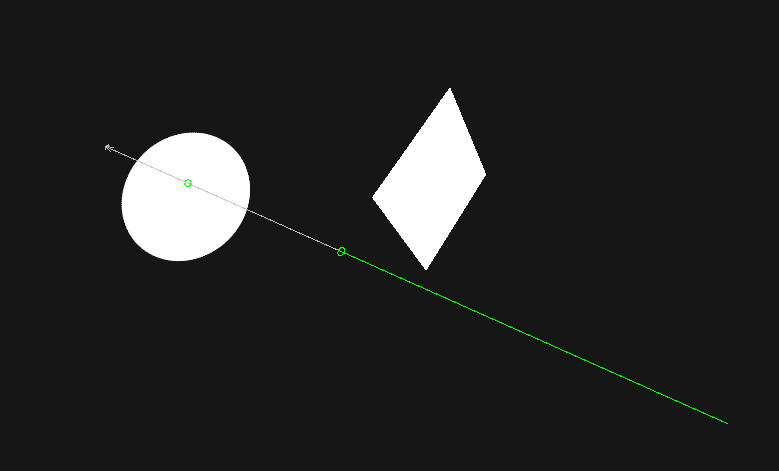
</details>
